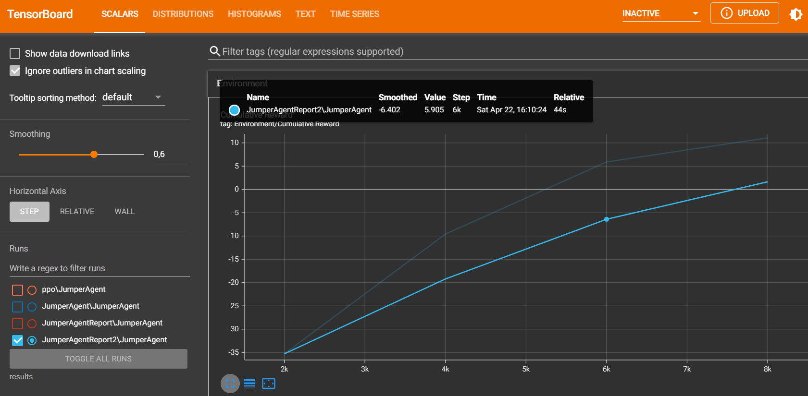

# Jumper Opdracht
## stap 1 - opdracht begrijpen
eerst project opbouwen zonder ML agent implementatie --> speler kan enkel springen, objecten bewegen naar hem toe.
objecten moeten steeds verschillende snelheid hebben en ik heb gekozen voor het continue laten bewegen van de obstakels.

daarna ML agent implementeren. reward toevoegen --> tags gebruiken en ik heb gekozen voor ray sensor.

## stap 2 - code
### speler
speler mag enkel spring --> freeze rotation, freeze positionX & Z.
Heuristic implementeren voor pijl functionaliteit voor ML agent werking. 
als speler object aanraakt moet object weg --> onCollision methode aanroepen.
speler moet kunnen springen --> upforce methode (ik wouw dat de speler ook downforce kon dus ook downforce methode).

### spawner
tijdinterval = hoe snel moet die objecten spawnen.
obstakel spawnpoint = waar moet die objecten spawnen
obstakel (gameObject) = welke prefab hij effectief moet spawnen.
na X aantal tijd spawn opnieuw een prefab.

### obstakel
Ik heb gekozen om mijn obstakels in een sinus golf te laten bewegen. Hier zijn verschillende manieren voor mogelijk. Echter kan het wel zijn dat ze door de grond bewegen maar dat vondt ik zelf niet storend.

Speed, hoe snel het vliegt naar de target
Wavespeed, lengte van periode van de sinus golf-lengte
Bonusheight, amplitude van de sinus (hoogte en laagte)

Eerst object niet laten bewegen. de 3 variabelen van zonet randomisen.
Update zorgt voor het bewegen van de obstakels.
OnCollisionEnter zorgt dat het obstakel verdwijnt als het speler raakt of eind-muur.

### score - hangt vast aan eindmuur
Canvas met text veldje aanmaken (niet als child van eindmuur).
OnCollisionEnter, als de eindmuur een obstakel aanraakt kan dit enkel omdat speler hem heeft kunnen ontwijken.
Eindmuur staat natuurlijk dus achter speler.

## ML agent implementeren
Agent moet dus de default scripten voor gedrag en beslissingen te maken krijgen. Alsook de ray sensor 3D script voor het zien van de obstakels.

### rewards:
vervolgens geef ik hem iedere seconde dat het spel loopt een zeer lage positieve reward.
Hoge negatieve reward als hij obstakel raakt.
Zeer lage negatieve als hij het 'plafond' raakt of grond (road).
Heb hem aangepast zodat hij probeert zoveel mogelijk afstand te behouden tussen zichzelf en obstakels maar alsook tussen zichzelf en road en wallTop.

### agent parameters
Ik heb eerst geprobeert met de default configuration.yaml te werken maar dit was niet echt werkende. Nadien heb ik die van CubeAgent gebruikt en dat bleek meteen te werken.
Dan heb ik hem voor een goede 10 min laten trainen en de demo is het resultaat. 

### grafiek
